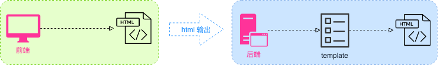
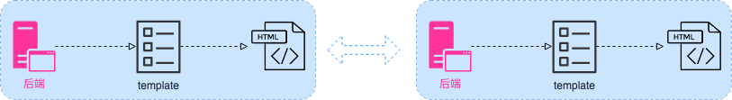
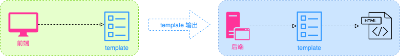
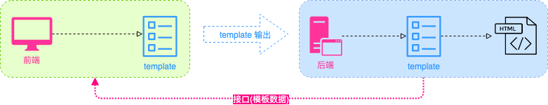
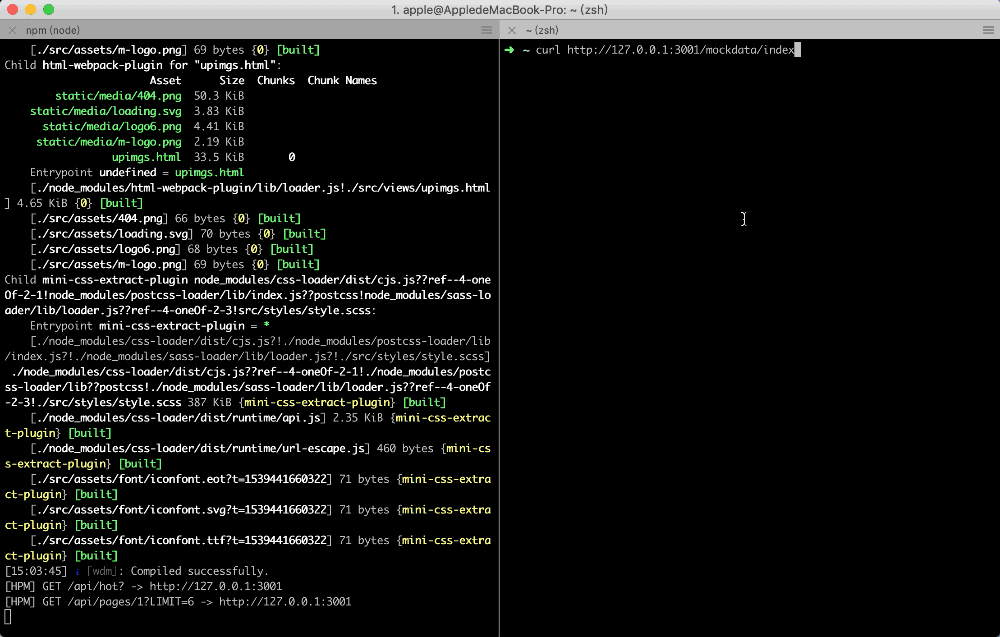

# 前后端合作新模式

本文主要介绍一种全新的前后端合作模式。在介绍这种模式之前咋们先来看看前后端合作模式的演变。

> singsong：该模式主要对传统多页面应用的改进。关于 SPA（Single Page Application，单页应用程序）可以参考 SRR（Server-Side Render，服务端渲染）。

## 演变

在那个前端角色比较弱化的年代，页面主要以静态页面为主。合作模式很简单粗暴。



前端开发完页面，输出给后端。后端拿到页面拼模板，然后再渲染输出。但随着前端业务复杂性逐渐地增加，这种模式合作起来就不是很愉快了。**后端在拼模板时，不能确保输出的页面结构与前端保持一致**。为了规避这个问题，聪明的开发人员就给前端同学建议：**使用后端开发环境开发前端页面**。



前端直接在本地部署后端开发环境，只负责 views 开发。再基于代码托管工具 git，实现前后端的合作。此时还是以后端为主导，维护性成本依然很高。

随着 node.js 的崛起，前端工程化也逐渐成为前端开发重要组成部分。各种构建工具（如webpack、rollup、grunt、gulp等），MVVM 框架（如React、Vue、Angular 等），模块化系统（cjs、amd、umd、ES6-modules等），CSS预处理器（SASS、Less、Stylus、Postcss等），模块管理工具（NPM、Yarn、brower等）犹如雨后春笋般不断涌现。SAP 也开始在前端领域流行来，前端能做的事情更多。如客户端渲染，静态分析、优化打包等。后端只需负责数据提供。此时，前后端已完全分离，各自负责各自的业务。


这种模式的核心：**客户端渲染 + 接口**。由于基于客户端渲染，对浏览器的 SEO 不是很友好。虽然可以通过 SRR 来解决，但是 SRR 也存在局限性。关于 SRR 感兴趣的同学可自行查阅相关的资料。本文主要探讨传统多页面应用构建的优化。

基于前端工程化，要让传统多页面应用也支持前后端完全分离。还需要做一件事，前端脚手架需要与后端使用相同的模板渲染引擎。前端编写好后，直接输出模板给后端使用。为此自己也构建一个 [fes](https://github.com/zhansingsong/create-fes) 脚手架。



再使用 fes 构建了几个项目后，尽管在开发体验、开效率上都得到了很大地提升。但在与后端合作时，需要提前约定好模板数据变量，一般会以文档形式进行说明。而这种合作方式工作起来不是轻松。因为在开发之前需要与后端约定好模板数据变量，一般会以文档形式进行说明。如果后端更新了数据，没同步更新文档，就会存在数据不一致的问题。对开发效率大打折扣，与传统的后端重新拼接模板相比优势不是很明显。秉着 geek 的精神，就想能不能**将模板数据以接口的形式提供给前端**。这样上述问题不就迎刃而解了么。



于是就对 [fes](https://github.com/zhansingsong/create-fes) 进行改造。让其支持模板数据接口的配置，在渲染之前会根据配置拉起接口数据，再进行渲染输出。同时还提供了接口数据适配功能，能让客户端更好地控制数据结构。
```js
mockConfig: {
  // 访问路径作为key
  '/index': {
    // 提供渲染mock数据接口
    api: 'https://postman-echo.com/get?page=index',
    // 格式化接口数据
    format: data => data.args,
  },
  '/fes/info': {
    api: 'https://postman-echo.com/get?page=info',
    format: data => data.args,
  },
}
```
另外，为了方便查看模板数据，开发模式下输入`mock`指令可获取当前的模板数据。

```js
$ mock
Mock Data:

{
    "/about": {
        "page": "about",
        "common": "commons",
        "data": "singsong",
        "name": "fes-about-page"
    },
    "/index": {
        "page": "index",
        "common": "commons",
        "name": "fes-index-page",
        "data": {
            "name": "fes"
        },
        "article": {
            "_value": {},
            "_state": 1
        }
    },
    "/post": {
        "common": "commons"
    }
}
```
如果需要查看对应页面数据，只需输入对应的路径即可。如 `/index`。
```js
$ /index
Mock Data [/index]:

{
    "page": "index",
    "common": "commons",
    "name": "fes-index-page",
    "data": {
        "name": "fes"
    },
    "article": {
        "_value": {},
        "_state": 1
    }
}
```
除了mock指令，还提供了如下指令：

- mock: 查看当前的 mock 数据
- view: 打印范围地址和二维码信息
- clear: 清空控制台

**这种合作模式，需要后端多做一件事。额外提供一个包含了渲染模板的数据的接口供前端使用（只存在开发环境下，在上线时需要关闭掉）。只需对该类接口定义特定的前缀，然后在模板渲染逻辑之前拦截输出数据。这样不仅能保持数据一致性，而且维护起来也方便。**


## Demo

这里以改进后 [fes](https://github.com/zhansingsong/create-fes) 进行演示。

### 前端修改

以**index 页面**为例进行讲解，模板数据接口为：`http://127.0.0.1:3001/mockdata/index`。接口返回的数据如下：

```js
{
  "rawdata": {
    "title": "index page"
  },
}
```
其中`/mockdata`为前缀，在 fes 中对模板数据接口进行如下配置

```js
mockConfig: {
  // 访问路径作为key
  '/index': {
    // 提供渲染mock数据接口
    api: 'http://127.0.0.1:3001/mockdata/index',
  }
}
```
这里如果我们只想要 `rawdata` 中的变量数据。可以通过`format` 进行适配。最后的配置信息如下：
```js
mockConfig: {
  // 访问路径作为key
  '/index': {
    // 提供渲染mock数据接口
    api: 'http://127.0.0.1:3001/mockdata/index',
    format: data => data.rawdata,
  }
}
```

### 后端修改

- 定义路由
  ```js
  // path: ./pages/index.js
  // 该接口与页面请求使用相同的路由处理，通过是否有`PREFIX`进行区别
  module.exports = (PREFIX = '') => [
    {
      method: 'get',
      path: `${PREFIX}/index`,
      middleware: require('../../controllers/index'),
    },
  ];
  ```

- 路由处理器
  ```js
  //path: ../../controllers/index.js
  module.exports = async (ctx) => {
    const { url } = ctx;
    // 从 DB 获取数据
    const getDataFromDB = () => {
      // 做一些数据查询操作……
      return {
        rawdata: {
          title: 'index page'
        }
      }
    }
    const data = getDataFromDB();

    // 判断是否有前缀进行不同的响应
    // 这里前缀以保存在 ctx.mockApiPrefix 中
    if (url.indexOf(ctx.mockApiPrefix) === 0) {
      ctx.body = data;
    } else {
      await ctx.render('index', data.rawdata);
    }
  };
  ```
  index 结构
  ```html
  <!DOCTYPE html>
  <html lang="en">
  <head>
    <meta charset="UTF-8">
    <meta name="viewport" content="width=device-width, initial-scale=1.0">
    <meta http-equiv="X-UA-Compatible" content="ie=edge">
    <title>{{ title }}</title>
  </head>
  <body>
    <h1>{{ title }}</h1>
  </body>
  </html>
  ```

- 注册路由
  ```js
  const Router = require('koa-router');
  const router = new Router();

  const pagesConfig = require('./pages');

  const config = [];
  // 定义前缀
  const MOCK_API_PREFIX = '/mockdata';
  // 注册页面路由
  config.push(...pagesConfig());

  // 注册模板数据接口
  if (process.env.NODE === 'dev') {
    config.push(...pagesConfig(MOCK_API_PREFIX));
  }

  const generateRoutes = (router, config) => {
    config.forEach(({ method, path, middleware }) => {
      router[method](path, middleware);
    });
  };

  module.exports = app => (ctx, next) => {
    // 绑定前缀，方便后续逻辑使用
    ctx.mockApiPrefix = MOCK_API_PREFIX;
    generateRoutes(router, config);
    app.use(router.routes()).use(router.allowedMethods());
    return next();
  };

  ```

运行效果：



