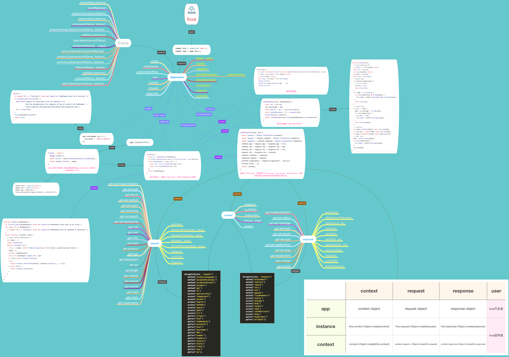

# 为什么我要构建这个脚手架

本文不是什么技术性介绍文章，准确地说算是自己的成长记录吧。刚参加工作时，组里使用的脚手架是由 leader 使用 webpack, gulp 搭建的 fex。当时只需知道怎么使用就行了，不过为了能更好地工作，对 fex 怎么构建一直很好奇，也一直关注相关的技术栈。经过一年多磨练后，对 fex 怎么搭建的有了个大概地认识。常言道："没有对比就没有伤害"。


在使用 vue-cli 构建第一个 vue 项目后，对脚手架构建有了个全新的认识。发现 fex 存在很多不足：

- 在打包时，只对 JavaScript 和 CSS 脚本文件进行打包压缩处理。不能对资源文件（如 img，字体等）进行依赖处理。导致在打包时：
  - 不能按需打包（即实际用到资源，才将其进行打包）
  - 不能进行 MD5 处理
  - 不能输出压缩版的 html
- 手动注入 JavaScript 和 CSS 脚本文件，如果需要做优化，会很不方便，特别在多页面情况下。
- dev 与 build 使用不同的技术方案，增加定制的成本。
- 基于 nodemon 对开发目录进行 watch，当执行修改操作时，会重启整个服务。会存在重启服务耗时比较长的情况，导致刷新页面出现空页面的情况，开发体验不是很好。
- 缺少 code-splitting、HMR、端口检测、Babel 等功能。

当然，fex 也有自己的优点。基于自建服务提供前后端复用模板功能。前端后端使用相同的模板语言，前端拼接的模板可以直接输出给后端使用。

第二年年初，组里项目不是太多，刚好有时间折腾一下，于是决定构建一个全新的脚手架 fes。为了尝试一些新东西，在技术栈上，都使用了当时最新的技术框架 webpack4、koa2、babel6 来搭建。为了了解 webpack 如何工作，对 webpack 就做了 8 次调试，才稍微对 webpack 整个架构有个初步认识。
> singsong: 在真正去了解 webpack 时，才知道它有多复杂。当然也参考了网上一些大神分享关于 webpack 源码分析的文章。反正整个过程还是挺熬心的🙂

同时，还对 koa2、babel6 做了相关的研究。附一张 koa2 分析图吧：


为了提高 fes 开发体验，除了继承 fex 的模板复用功能外，还集成了 vue-cli 中不错的功能。

- 兼容 macOS、windows、Linux 等操作系统。同时兼容主流浏览器及 IE 低版本
- ES6、SASS
- js-code-splitting、css-code-splitting
- 多页面开发环境
- proxy
- css autoprefixer
- css/svg sprite
- 支持更灵活定制，如是否自动打开浏览器、热加载等配置
- 自动监听 port，如果被占用，提示性切换
- 打包优化分析
- 模板输出(便于后端复用模板)
- 基于[mockjs](https://github.com/nuysoft/Mock/wiki/Getting-Started) 模拟 api

在搭建 fes 过程中，自己对前端代码规范化的重要性有了自己的一些思考：

> 前端开发的规范如 JavaScript 弱类型特性一样，没有统一规范。每个人都有自己的一套编码风格。这对团队来说并不是一件什么好事。就拿我们团队来说吧。大多数的项目（前端）都是由个人来维护，很少有团队合作的项目。因为每个人编码风格不同，导致下个接手维护的人需要重新习惯这种编码风格。这就存在一定的学习成本，而且效率不高。可能原维护人只需花几分钟解决的事，接手人需要花几个小时，甚至更多的时间和精力。对团队合作项目来说，统一的编码风格显得更为重要。因为不同的编码风格会让团体开发进度大打折扣，维护起来也很费力。另外，开发人员会对彼此编码习惯存在不同程度的排斥现象。
>
>项目规范化的辅助性工具：
>
>- eslint：规范 js 代码
>- stylelint：规范 css 代码
>- editorconfig：规范 IDE
>- husky 和 lint-staged：在 pre-commit 时 eslint、stylelint，确保风格一致、高质量的代码输出。
>
>规范化的好处：
>
>- 规范化团队的编码风格，便于团队内项目的维护。
>- 规范化可让开发规避一些常见的错误。如未使用的变量；文件命名错误，未能成功导入等。
>- 规范化对新人有很好的指导作用，好的开始很重要。因为这些规范都是行业内一些最佳实践，可让新人成长得更加专业化。

为了促进团队的代码规范化，自己也将 eslint、stylelint、prettier、husky、lint-staged 集成到 fes 中。

当然整个 fes 搭建过程中也并不是一帆风顺的，途中也遇见一些坑：

- koa2 与 html-webpack-plugin

  在开发模式下，fes 是基于 html-webpack-plugin 插件自动生成 HTML 文件，而 html-webpack-plugin 插件合成的 html 缓存于内存中，为了配合 koa2 输出合成的 html 文件，需要将 html 文件写入磁盘中。而要将 html-webpack-plugin 合成的 html 文件输出到磁盘中，需要借助 html-webpack-harddisk-plugin 插件。html-webpack-harddisk-plugin 是个基于 html-webpack-plugin 的插件。

- html 中 img 的解析

  向来 webpack 对 html 的解析不是很友好。虽然 webpack 提供了 html-loader 来解析 html 中的 img。但 html-loader 是基于字符正则匹配来解析，即解析的是 html。但 fes 使用的是模板文件，这就需要对应模板 loader 来将其转换为 html。而 webpack 对 loader 的实现制定了相关的规范，为了提高编译性能，loader 一般返回的是一个 runtime 字符串，而不是最终编译后的输出。这样不仅有效地避免每次重新生成，也方便共享。所以为了能让 html-loader 解析模板文件，需要对模板 loader 做些定制，将其输出由 runtime 变为最终输出编译结果。

- 对 twig 模板 `include` 文件修改，重编译不生效

  开启 `twig.cache(false)`，也不能解决这个问题。经查阅 twig.js 源码后，需要通过`twig.extend`扩展，对缓存对象进行初始化，来禁掉缓存。

  ```js
  // 去掉缓存
  Twig.extend(T => {
    if (T.Templates && T.Templates.registry) {
      T.Templates.registry = {};
    }
  });
  ```

- postcss-sprites 不支持 webpack 的 alias

  因为 postcss-sprites 是 postcss 的插件，独立于 webpack。要让 postcss-sprites 支持 alias，只能扩展 postcss-sprites 让其支持与 webpack 一样的 alias 配置项。需要在遍历样式节点时，根据 alias 配置项替换，换成真实数据。

  ```js
  const replaceAlias = image => {
    const {alias} = opts;
    let {url, originalUrl} = image;
    const tempUrl = url;
    if (/^~/.test(url)) {
      Object.keys(alias).forEach(item => {
        url = url.replace(RegExp('^~' + item), alias[item]);
        if (url !== tempUrl) {
          originalUrl = path.relative(path.parse(styleFilePath).dir, url);
          url = originalUrl;
          // 替换源码
          rule.replaceValues(tempUrl, {fast: tempUrl}, s => url);
        }
      });
    }
    image.url = url;
    image.originalUrl = originalUrl;
    return image;
  };
  ```

- 模板复用

  fes 是基于 webpack-html-plugin 插件自动生成合成的 html 文件。但为了提供工作效率，业务中存在对模板复用的需求，所以需要重新定制输出。

  > 思路：通过 webpack-manifest-plugin 输出资源清单 manifest，再根据 manifest 将资源注入到模板中。另外，为了方便替换 html 中的图片资源，还需要将 html-loader 解析结果作为依赖替换。

  ```json
  {
    "commonScripts": {
      "common.js": "/static/js/common.486cb059.chunk.js",
      "vendors.js": "/static/js/vendors.11aa87af.chunk.js"
    },
    "commonCss": {
      "common.css": "/static/media/common.6094b30a.css"
    },
    "scriptFiles": {
      "index.js": "/static/js/index.bc043de1.js",
      "home.js": "/static/js/home.d8768213.js",
      "about.js": "/static/js/about.a3e6551a.js"
    },
    "cssFiles": {},
    "assets": {
      "static/media/puppy.jpg": "/static/media/puppy.da5595d8.jpg",
      "static/media/ant2.png": "/static/media/ant2.89ca7b1b.png",
      "static/media/ant1.png": "/static/media/ant1.ed485ba9.png",
      "static/media/husky.jpg": "/static/media/husky.4063f14b.jpg"
    },
    "htmlFiles": {
      "about.html": "/about.html",
      "home.html": "/home.html",
      "index.html": "/index.html"
    }
  }
  ```

大概经历一个半月的时间，fes 也如期而至。于是就在组里推广使用，自己也使用开发了几个项目。与 fex 相比，fes 在开发效率、体验上都得到很大的提升。但同时也暴露一些问题，其中最头疼的问题是：由于没有将核心代码提取作为依赖包。导致在使用过程中升级维护不是很方便。一般若发现问题都是现场解决，然后再同步到代码库中。但这样不能很好地将代码同步其他已使用项目中。


在经过半年的沉淀后，决定对 fes 进行重构。并整理了一些优化点：
- 优化热加载。
- 支持模板语言 loader 的配置。
- 支持 css 预处理器 loader 的配置。
- 引入 common.js，方便添加公用代码，避免每个 js 文件重复引用。
- 优化某些页面没有对应的 js 文件。
- 去掉 jquery 中为默认内置。
- 支持路由配置。
- 支持多级目录结构。
- 将 media.json 放入 gitignore。
- sprite 合成会引起一次编译，大多数情况这次编译是多余的。
- 可以将 start、tmpl、preview 脚本进行优化，提出共有逻辑，增加复用性，和可维护性。
- 支持 CSS-Modules。
- 支持 typeScript。
- 优化编译，打包时间。
- 增加 service worker。

不过在重构过程中，在是否将 Babel 内置于 fes 中有了一些新的思考 🤔。

> 在搭建 fes 初版时，只要觉得功能不错都会集成于 fes 中。但并不是所有的项目都需要所有功能，而且这样会导致 fes 变得臃肿。也就是说有些可选功能，没必要作为内置功能。如 babel、typeScript、stylelint、eslint、precommit 等。其实 fes 只需内置基础架构即可，其他可选功能可以通过配置来定制。这样不仅可让 fes 变得灵活轻巧，而且也方便扩展。


为了将 fes 的核心代码提取作为依赖包，参考了 [create-react-app](https://github.com/facebook/create-react-app) 构建。毕竟 create-react-app 是个明星项目，技术也相对稳定成熟。加上之前也使用 create-react-app 构建几个 react 项目，对其也算有点了解，不过只停留在使用上。如果要重构 fes 还需要对 create-react-app 源码深入研究一番。

整个 fes 的构建完全基于 create-react-app。代码结构也由两个 packages 组成：create-fes 和 fes-scripts。但对于如何维护这两个 packages 是一个很棘手的问题。如果独立分开管理，开发起来不是很方便，后期维护成本也高（如版本号维护）。于是查看了 create-react-app 源码，发现在其源码中有一个 `lerna.json` 文件。好奇这个文件是做什么的，就了解一番。经查阅了解到 [Lerna](https://github.com/lerna/lerna) 可以用来管理项目中多个 packages。这正是自己所需要的，为此自己也专门写了一篇 Lerna 文章：[monorepos by lerna](./Lerna-monorepos.md)。

在这次重构中自己也做了一些优化，让 fes 的体验得到很大地提升。

- 动态响应mock api（模拟服务请求接口）

  在 fes 初版时，对 mock api 的修改，需要重启服务才能生效。这样体验在开发中不是很友好的。于是就开始折腾，有木有什么方法能让 mock api 的修改不用重启就能生效。一开始想到的解决方案是基于 `nodemon`，但是这样只要对 mock api 文件做修改，就会重新服务。如果频繁地修改，会不停地重启服务，影响到正常的开发服务，不是很理想。那另开一个服务来专门服务于 mock api，再基于 `nodemon` 监听变化，这样就不会影响正常的开发服务。但这样整个架构就变得有点重了。看来基于`nodemon`的思路是走不通了，只能换一个思路🤔。对请求响应着手，在响应请求时，去掉缓存，确保每次响应都是最新的数据，这样问题不就迎刃而解么😝。但需要过滤掉静态资源的请求，不然会影响页面的响应时间。

  ```js
  // mockApi 中间件
  const mockApi = async (ctx, next) => {
    if (!ctx.path.includes('/static')) { // 过滤掉静态资源
      // avoid loading static resources with delay
      const mockContext = {
        mock(path) {
          const url = join(paths.appApis, path);
          delete require.cache[url];// 删除缓存
          return Mock.mock(require(url)); // eslint-disable-line
        },
      };
      delete require.cache[join(paths.appApis, 'index.js')];// 删除缓存
      const api = require(paths.appApis); // eslint-disable-line
      const mockData = api.call(mockContext);
      const responseBody = mockData[ctx.url];

      if (responseBody) {
        ctx.body = responseBody;
        if (typeof responseBody === 'function') {
          try {
            const responseBodyFromFun = responseBody.call(mockContext);
            ctx.body = responseBodyFromFun.data;
            if (typeof responseBodyFromFun.others === 'function') {
              responseBodyFromFun.others(ctx);
            }
          } catch (error) {
            console.log(`${chalk.bold.red('Error: ')}`, error);
          }
          console.log(`${chalk.black.bgYellow('MOCK-APIs')}   ${chalk.bold.green(ctx.method)}  ${chalk.gray('--->')}  ${chalk.dim(ctx.url)}`);
        }
      }
    }
    await next();
  };
  ```
- css 热加载

  之前 webpack 支持 css 热加载，一直由 [sytle-loader](https://github.com/webpack-contrib/style-loader) 来完成。而 style-loader 是基于 js 将待更新的 css 注入到 DOM 中，这样会导致 FOUC(flash of unstyled content) 问题。为了避免 FOUC，可以使用 [mini-css-extract-plugin](https://github.com/webpack-contrib/mini-css-extract-plugin)，尴尬的是 mini-css-extract-plugin 不支持 hmr。不过可以配合 [css-hot-loader](https://github.com/shepherdwind/css-hot-loader) 让其支持 hmr。而 css-hot-loader 工作原理是将 mini-css-extract-plugin 提取的 css 中注入热加载相关代码来实现热更新的。

  好消息是在重构过程中 [mini-css-extract-plugin](https://github.com/webpack-contrib/mini-css-extract-plugin) 在 0.0.6 版本开始支持 hmr🎉🎉🎉。

  ```js
  const MiniCssExtractPlugin = require('mini-css-extract-plugin');
  module.exports = {
    plugins: [
      new MiniCssExtractPlugin({
        // Options similar to the same options in webpackOptions.output
        // both options are optional
        filename: '[name].css',
        chunkFilename: '[id].css',
      }),
    ],
    module: {
      rules: [
        {
          test: /\.css$/,
          use: [
            {
              loader: MiniCssExtractPlugin.loader,
              options: {
                // only enable hot in development
                hmr: process.env.NODE_ENV === 'development',
                // if hmr does not work, this is a forceful method.
                reloadAll: true,
              },
            },
            'css-loader',
          ],
        },
      ],
    },
  };
  ```

- [template]-loader

  为优化，webpack loader 在输出时，一般都是一个 **js runtime** 字符串。而 **js runtime** 对`html-loader`不是很友好，特别对一些结构完全与html结构不相似的 template engine，如`pug`。如果不使用`html-loader`可以忽略。但在实际开发过程，在 html 中直接插入图片或其他资源还是个很常用的需求。

  要解决这个问题，需要对 loader 做一些定制。确保 loader 的输出是编译好的 html，这样对下游`html-loader` 处理就很友好了。同时，这样也方便对 mock 数据的处理。

  另外，在编写 template loader 时，需要确保支持视图模板文件 base 目录的指定，即支持绝对路径引用。因为后端常使用绝对引用方式。为了方便前后端模板复用，最好与后端的引用方式保持一致。

- 去掉 [postcss-modules](https://github.com/css-modules/postcss-modules)，使用 css-loader 的 css-modules

  之前使用 postcss-moudles，主要解决将经过css-modules 编译后的类名对象与模板变量数据合并作为模板渲染数据。这种模式对当前的开发场景来说不如将在js中使用灵活。
  > 尝试：将 css-modules 与模板数据结合在一起也算一种新尝试。可以制定一定规范，只要所有模板都遵循这一套规范也是一种不错的开发方式。

- 将 runtime chunk 合并到 vendors 中。

  在对打包进行优化时，为了使用浏览器缓存，使用 `runtimeChunk: 'single'` 提出 runtime chunk。同时也使用`splitChunks`生成一个 commons chunk 和 vendor chunk。因为 runtime chunk 和 vendor chunk 属于不常改变的代码，可以将两者打包到一个 chunk 中。
  查阅文档，也没有提供相关的方法。于是就去了 webpack 的 [gitter](https://gitter.im/webpack/webpack) 和 [Stack Overflow](https://stackoverflow.com/questions/53520881/how-to-bundle-the-runtime-chunk-generated-into-explicit-vendor-chunk-in-webpack) 提问。但是没有人鸟我 😣（也许自己的英语太差，没有表述清楚🤣或这个问题 too easy）。

  ```js
  module.exports = {
  entry: {
      pageA: "./pageA",
      pageB: "./pageB",
      pageC: "./pageC"
  },
  mode: 'development',

  optimization: {
      runtimeChunk: 'single',
      splitChunks: {
          cacheGroups: {
              commons: {
                  chunks: "initial",
                  minChunks: 2,
                  maxInitialRequests: 5, 
                  minSize: 0
              },
              vendor: {
                  test: /node_modules/,
                  chunks: "all",
                  name: "vendor",
                  priority: 10,
                  enforce: true
              }
          }
      }
  },
  output: {
      path: path.join(__dirname, "dist"),
      filename: "[name].js"
    }
  };
  ```
  后续，在帮同事将老项目迁移到 fes 中时，因为存在历史包袱，需要重新定制打包方式。在此过程中无意中发现一种方式解决方案：
  ```js
  module.exports = {
    entry: {
        pageA: "./pageA",
        pageB: "./pageB",
        pageC: "./pageC"
    },
    mode: 'development',

    optimization: {
        runtimeChunk: { name: 'vendor'},
        splitChunks: {
            cacheGroups: {
                commons: {
                    chunks: "initial",
                    minChunks: 2,
                    maxInitialRequests: 5,
                    minSize: 0
                },
                vendor: {
                    test: /node_modules/,
                    chunks: "all",
                    name: "vendor",
                    priority: 10,
                    enforce: true
                }
            }
        }
     },
     output: {
         path: path.join(__dirname, "dist"),
         filename: "[name].js"
       }
     };
  ```
  将 `runtimeChunk: { name: 'vendor'}` 的 `name` 设置与 `cacheGroups['vendor']['name']: "vendor"`相同即可，就这么简单🙂。

- focus，提高编译速度

  在进行项目迭代时，有时需要新增页面。如果项目已存在页面很多。这样每次编译都需要重新编译一遍，会导致整个编译速度变得很慢。而在开发时，其实只需关注新增的页面，其他的页面是没必要编译的。所有就新增这个 `focus` 功能，来提高编译速度。只需指定新增的页面的文件名即可，同时支持多个文件名的指定。

- 减少读磁盘操作

  在 fes 初版的开发模式下，fes 是基于 html-webpack-plugin 插件自动生成 HTML 文件并缓存在内存中，为了配合 koa2 输出合成的 html 文件，需要借助 html-webpack-harddisk-plugin 插件将 html 文件写入磁盘中。

  为了减少读磁盘操作，基于 `global` 将 html 数据存储在 `global.__fes_bind_views_data__` 变量中。另外，还将 html-loader 解析的结果由之前的 `media.json` 文件转由 `shareData` 变量代替。

- foolMode

  该模式是针对一些简单项目而新增的功能，在打包时会将所有的文件打包到一个文件，即最后输出结果一个js、一个css。

- debug

  该模式主要用于帮助调试打包代码。在开启 debug 模式，build 出的代码不会被压缩，同时生成source map。方便开发调试。

到此 fes 构建之旅也告一段落，接下就不断地完善。

这就是自己构建 fes 的过程。构建过程中存在很多挑战，特别遇见一个花很多天也不能解决的问题，对自己的积极性、自信心打击还是挺大的。途中真有想放弃的念头，欣慰的是自己最终还是坚持了下来😀。虽然在搭建完后，成就感并不如想象中那么大。因为感觉就那么一回事，觉得任何人只要花点时间也能完成。不过整个过程下来自己也收获不少。无论是在技术知识上、或对问题处理上等都得到了很大地提升。同时对自己也有了一个新的认识。人嘛就得对自己狠点，不然你真不知道自己有多大的潜能🤣。

好了，文章到此就结束。重构的 fes 已放置 [github: create-fes](https://github.com/zhansingsong/create-fes)。毕竟团队业务场景存在局限性，加上个人能力有限。为了让 fes 变得更好，最好的选择就是将其放置github。

喜欢的小伙伴请随意 [github: create-fes](https://github.com/zhansingsong/create-fes) 拉代码体验。欢迎使用🙂欢迎使用🙂欢迎使用🙂
